# Temperatur und Luftfeuchte überwachen

# Einführung / Idee

In Wohnungen beschlagen oft Fenster von innen, weil nicht richtig gelüftet wird oder weil die Luft zu feucht ist.
Um das genauer untersuchen zu können, wird in diesem Projekt ein Gerät gebaut, das Temperatur und Luftfeuchte im Laufe eines Tages aufzeichnet und dann zur Analyse an einem PC bereitstellt.

In diesem Projekt soll ein Prototyp dafür erstellt werden.
An disem soll man lernen können

1. dass die Idee grundsätzlich funktioniert
1. ob einfache Sensoren schon ausreichen sind
1. wie eine Analyse am PC aussehen könnte

# Anforderungen

- Als Wohnungsbewohner möchte ich das Gerät mit minimalem Aufwand aufstellen können.
- Als Analyst möchte ich die Daten schnell auslesen können.
- Als Analyst möchte ich die Daten in einem Format vorliegen haben, das gängige Auswertungsprogramme gut verarbeiten können, damit ich sie nicht vorher noch aufwändig konvertieren muss.

| Anforderung | Erklärung |
| ----------- | --------- |
| Einfache Bedienbarkeit | Auch Laien sollten in der Lage sein, das Gerät Daten aufzeichnen zu lassen.  Sie sollten es möglichst nur einstecken müssen. |
| Klar ersichtlicher Status | Der Betriebsstatus des Geräts (_Zeichnet auf_ oder _Fehler_) sollte sehr einfach erkennbar sein |
| Speicherplatz | Die Daten eines kompletten Tages (24h) sollten erfasst werden können. |
| Präzision | Die Daten sollten mit einer Genauigkeit von 1 Grad C bzw. 5% Luftfeuchte gespeichert werden |
| Einsatzbereich | Das Gerät sollte in normalen, beheizten Gebäuden betrieben werden können, also zwischen 15 und 40 Grad C messen können. |
| Austauschformat | Das Format, in dem das Gerät die gespeicherten Daten ausliefert, sollte kompatibel sein zu Programmen, mit denen man die Auswertung machen kann -- mindestens Excel, Libreoffice, octave, gnulot. |

# Planung

Grob sieht die Architektur so aus:

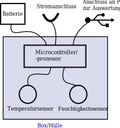

Die oberen drei Anschlüsse können alle zur Stromversorgung genutzt werden, es sollte einer von drei reichen, um das Gerät zu betreiben.

## Wahl der Rechenplatform

Zur Auswahl stehen:

- Microcontroller: Arduino & Co
- Microprozessor: bspw. Raspberry PI
- PC: Gerät könnte direkt per USB an den PC gehängt werden und dann direkt messen und Auswerten

Kriterien für die Entscheidung:

- Stromverbrauch: niedrig um Umwelt nicht unnötig zu belasten
- Portabilität: Stromversorgung per Batterie sollte einen Tag lang möglich sein
- Datenspeichermöglichkeit: Datenspeicher für einen Tag muss vorhanden sein
- Benutzerfreundlichkeit: Muss von Laien gut bedient werden können

| Kriterium | *Microcontroller* | Microprocessor | PC |
| --------- | ----------------- | -------------- | -- |
| Stromverbrauch | [ca 0.2 W](https://arduino-projekte.info/stromverbrauch-arduino-wemos-boards/) | ca [2 W](https://www.elektronik-kompendium.de/sites/raspberry-pi/1910071.htm) | irrelevant |
| Portabilität | sehr gut -- 9 V Block reicht | befriedigend -- braucht Powerbank | Durch Kabellänge begrenzt -- uncool |
| Datenspeichermöglichkeit | on-board eingeschränkt, Erweiterung möglich | auf SD-Karte gut möglich | unproblematisch |
| Benutzerfreundlichkeit | gut; kann direkt bei Stromanschluss anfangen zu messen | wie Microcontroller | kritisch; Programm muss installiert werden, korrekter USB vorhanden sein |

Die Wahl fällt auf den Arduino, weil seine Rechenpower aufsreichend für so unkomplizierte Aufgaben ist und er sehr wenig Strom verbraucht.
Außerdem lässt er sich in Schlafzustand versetzen und verbraucht dann noch weniger Strom.
Einzig kritisch: Speicherplatz muss vorhanden sein, siehe deshalb folgenden Punkt.

## Wahl der Möglichkeit um Daten zu speichern

Der Arduino hat eingebaut:

- SRAM -> Volatil (also weg nach Reset)
- EEPROM -> beschreibbar, aber nur 1 kilobyte groß
- Flash -> kann im Betrieb nicht beschrieben werden

Man kann den Arduino erweitern um bspw.

- [SD-Karten-Leser](https://funduino.de/nr-28-das-sd-karten-modul) -> Extern, Kostet ca 2 Euro, Library zum Ansteuern ist vorhanden.
- Externen EEPROM, wie [bspw. dieser hier](https://www.reichelt.de/eeprom-4-kb-512-x-8-2-5-5-5-v-so-93lc66a-i-sn-p96708.html?r=1) -> Externer Baustein der Speicher erweitert

Um entscheiden zu können, ob der SD-Karten-Leser notwendig ist, wird folgende Überlegung angestellt:

- alle 5 min sollen zwei Messungen (Temperatur und Luftfeuchte) genommen werden.
- `24h = 24 * 12 * 5min` -> Man braucht `24 * 12 = 288` Messungen für einen Tag
- Eine Messung kann man in je 1 Byte speichern, also 2 Byte pro „Zyklus“
- Damit braucht man für einen Tag 576 Byte.

Der EEPROM ist also ausreichend und es gibt
[eine Library](https://www.arduino.cc/en/Reference/EEPROM)
um ihn zu programmieren.

| Kriterium | *EEPROM* | SD-Karte | Externer EEPROM |
| --------- | -------- | -------- | --------------- |
| Speicherplatz | sehr wenig aber grade ausreichend | beliebig viel | bspw. 4000 Bytes für genauere Messungen |
| Aufwand zum Programmieren | gut | gut | aufwändig |
| Kosten | 0 | ca 2 Euro + SD-Karte also insgesamt recht teuer | ca 30 ct |

## Wahl der Sensoren

Die Sensoren DHT11 und DHT22 haben beide gewünschten Sensoren integriert.

[DHT22 wäre genauer als DHT11](https://test-wetterstation.de/temperaturmessung-mit-dem-arduino) und eigentlich wünschenswert.
Insbesondere scheint der DHT11 einen systematischen Fehler zu machen.

Weil der DHT11 schon verfügbar ist, wird dieser zumindest für einen Prototypen verwendet.
Eine genauere Recherche, welch Sensoren verwendet werden können, sollte durchgeführt werden, wenn dieser Sensor nicht die erwünschten Ergebnisse liefern kann.

# Architektur

## Zeitverhalten

Die Nutzung des Geräts für einen Laien soll wie folgt ablaufen:

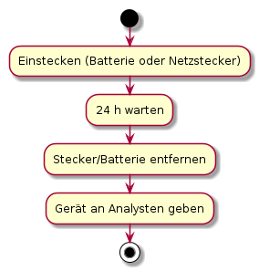

Intern soll dabei das folgende Programm ablaufen:

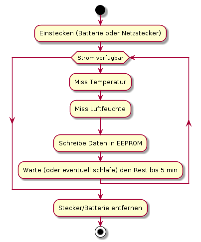

Initial war ein Ringbuffer vorgesehen, sodass man immer Daten speichern kann.
Stattdessen wird wenn der Speicher voll ist, einfach keine neuen Daten mehr aufgenommen:

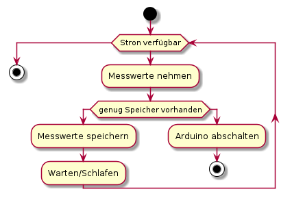

Der Analyst soll wie folgt damit umgehen:

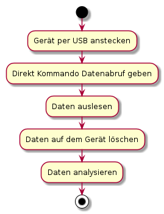

Den Befehl, für den Datenabruf, ist `print all`.

## Aufbau

Durch die Wahl des Sensors besteht das Gerät aus den folgenden Komponenten:

1. Dem Arduino
1. Dem Sensor (mit Widerstand)
1. 2 LEDs zur Statusanzeige

Die Stromversorgung kann beim Arduino über den USB-Port oder über eine 9V-Batterie erfolgen, deshalb ist hier nichts weiter erforderlich.

### Mechanischer Aufbau

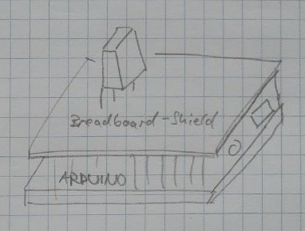

Der Arduino wird mit dem [Uno Prototype Shield](https://www.makershop.de/zubehoer/breadboard/uno-proto-shield/) betrieben.
Darauf haben alle Komponenten Platz und der Aufbau ist relativ transportabel.

### Elektrischer Aufbau

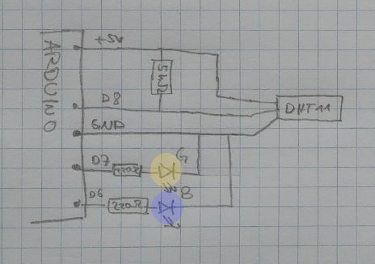

Der Anschluss des Sensors wird [hier](https://mega.nz/#F!F1gj0Y7L!vrf91AD2b5OowYc43dSR7Q!J0QwDajR) beschrieben.
Er braucht einen Pull-Up Widerstand von 5 kΩ.

# Plan

## Teile

- Arduino Uno
- DHT11
- LEDs
- Widerstände

## Zeitplan

1. Vorbereitung/Planung (3h)
1. Einzelne Komponenten zum Laufen bringen
    1. EEPROM lesen und schreiben (1h)
    1. Sensor anschließen und Werte auslesen (1h)
    1. [Ringspeicher](https://de.wikipedia.org/wiki/Digitaler_Ringspeicher) programmieren, der neue Werte aufnehmen kann (2h)
    1. Kommunikation per UART: Wie kann man dafür sorgen, dass der Arduino merkt, dass er die gespeicherten Werte abspielen soll, statt neue aufzunehmen? (1h)
1. Komponenten integrieren.  Tests ausführen.  (2h)
    1. Nimmt Gerät auf und speichert die Werte?
    1. Kann man die Werte auslesen?
1. 24h Dauerlauf starten -- idealerweise zeitweise Daten mit anderen Messgeräten erfassen so dass man nachher vergleichen kann. (1h)
1. Daten auslesen und interpretieren.  Test: Sind die Daten aussagekräftig genug?  (1h)
    - Falls bei Dauerlauf Referenzdaten aufgezeichnet wurden, vergleichen.
1. (Stretch-Goal -- wenn keine Zeit mehr, dann nicht machen:) Sleep Mode ausprobieren: Kann man den Arduino schlafen legen und nach bestimmter Zeit wieder wecken um Strom zu sparen? (2h)
1. Abschließend: Evaluation (1h)

# Protokoll

## Doppelstunde 1 und 2: Vorbereitung

- Vorbereitung: Einführung, Anforderung und Planung
- Vorläufiger Zeitplan

## Doppelstunde 3: Vorbereitung

- Mechanischer und Elektrischer Aufbau recherchieren/planen

## Doppelstunde 4 und 5: EEPROM

EEPROM zum Laufen bringen.

Für EEPROM gibt es eine [Library](https://www.arduino.cc/en/Tutorial/LibraryExamples).

EEPROM kann nur einzelne Bytes (`unsigned char`) lesen und schreiben.

Dazu reicht schon

    #include <EEPROM.h>
    EEPROM.read(<address>);
    EEPROM.write(<address>, <value>);

Um Integer (`int` -- 2 Bytes) zu schreiben, müssen diese zerlegt werden in _Most Significant Byte_ und _Least Significant Byte_; die Umwandlung ist (siehe bspw. [hier](https://stackoverflow.com/a/5585569/2165903))

    // int -> bytes
    int value;
    unsigned char msb = value & 0xFF00;
    unsigned char lsb = value & 0x00FF;

    // bytes -> int
    int value = (msb << 8) + lsb;

Das Program [`lesson44_eeprom.ino`](lesson44_eeprom.ino) zeigt, wie man den EEPROM lesen und schreiben kann.

Es verwendet auch schon den Serial um Kommunikation mit dem Gerät herzustellen und explizit nach Werten zu fragen.
Das kann man später für „Kommunikation per UART“ verwenden!

Um ein schönes Programm zu erhalten, das schon die Basis-Funktionalität für „Kommunikation per UART“ hat, hat es etwas länger gedauert, um die Dokumentation zu
[`Serial`](https://www.arduino.cc/reference/en/language/functions/communication/serial/)
und
[`String`](https://www.arduino.cc/reference/en/language/variables/data-types/stringobject/)
zu lesen.

## Doppelstunde 6: DHT11

DHT11 zum Laufen bringen.

Der erste Aufbau sieht so aus:

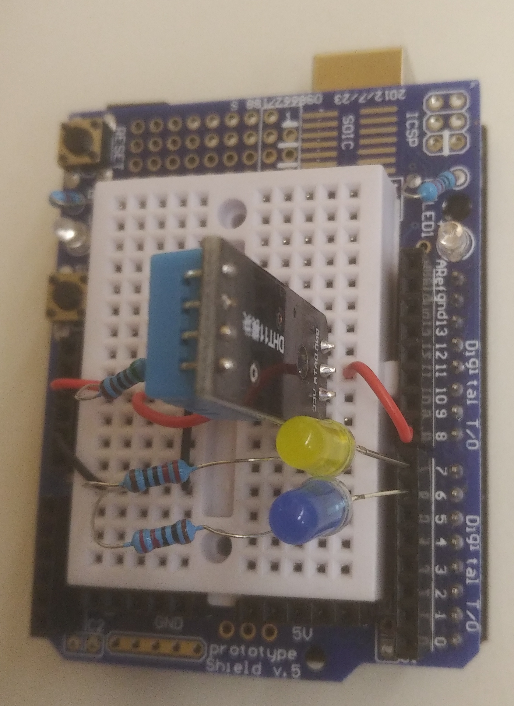
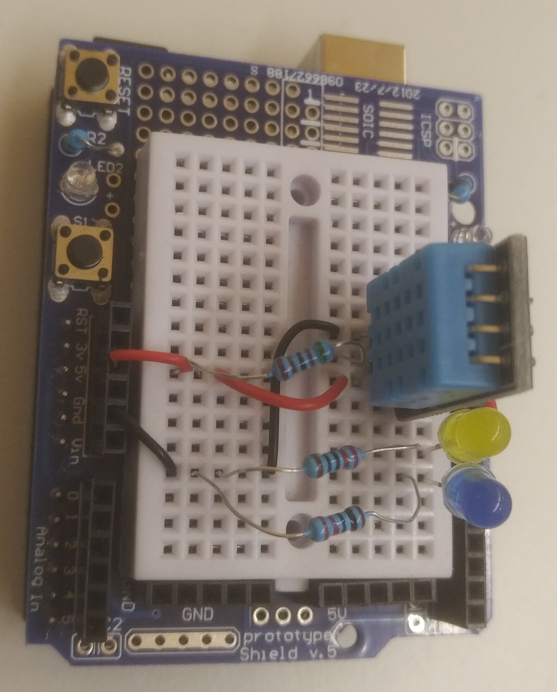

Er enthält neben dem DHT11 auch schon die beiden LEDs.

Ich verwende die
[_DHT sensor library fon Adafruit_](https://github.com/adafruit/DHT-sensor-library), Version 1.3.8.
Das Beispielprogram von dort dient als Einstieg, um den DHT11 zum Laufen zu bringen.

Die modifizierte Version davon ist
[`lesson45_dht11.ino`](lesson45_dht11.ino).

Damit produziert der Arduino den Output, den man in
[hauchen.dat](hauchen.dat) finden kann; visualisiert ist das

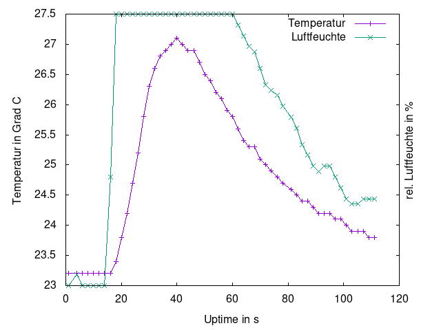

Das ist genau das erwartete Verhalten:
Temperatur und Luftfeuchte steigen durch die warme Atemluft an, danach kühlt der Sensor exponentiell ab
([Newton'sches Abkühlungsgesetz](https://www.spektrum.de/lexikon/physik/newtonsches-abkuehlungsgesetz/10298)).

Auch nach einem Reset des Arduino wird noch die gleiche Temperatur angezeigt.

Als Basistest ist das ausreichend, um zu sehe, dass wir den DHT11 ansteuern können.

## Doppelstunde 7 und 8: Ringbuffer

Nach etwas Überlegung ist es wahrscheinlich gar nicht notwendig, einen Ringbuffer zu bauen.
Die Idee eines Ringbuffer ist ja, dass falls neue Daten hinzukommen, aber der Speicher schon voll ist, die neuen Daten einfach alte überschreiben.
Mit gleicher Berechtigung kann man aber sagen, dass die alten Daten genau so wertvoll sind wie die neuen.
Man kann also auch einfach so verfahren, dass wenn kein Platz mehr vorhanden ist, die neuen Daten verworfen werden.
Damit hat man ein einfacherern Ablauf:

Beim nochmaligen Lesen der Dokumentation von der Arduino EEPROM-Library habe ich `EEPROM.get()` und `EEPROM.put()` gefunden, die ich vorher übersehen hatte.
Mit diesen Funktionen kann man auch größere Daten (bspw. `int`) im EEPROM speichern und muss dadurch nicht die „Tricks“ mit LSB und MSB (s.o.) verwenden.

Eine Implementierung des Datenspeichers ist
[hier](datenspeicher.cpp)
zu finden.
Sie mockt den Zugriff auf EEPROM, sodass man die Tests auch auf einem normalen Rechner laufen lassen kann, sodass man bei Problemen debuggen kann.

Die Implementirung des Datenspeichers war aufwändiger als gedacht.
Vermutlich ist er overengineered -- man hätte auf Abstraktion und „Sauberkeit“ des Codes verzichten können und schneller etwas haben können, das funktioniert, aber vielleicht weniger anpassbar und leserlich ist.

## Doppelstunde 9: UART

Der Zugriff per UART soll erlauben, die Daten auszulesen.
Wenn man keine Daten auslesen will, dann soll das Gerät einfach Daten aufzeichnen.

Die Strategie sieht wie folgt aus:

Nach jedem Reset

1. Aktiviere UART
1. Warte 30 sek. auf eine UART-Nachricht
1. Kommt in der Zeit eine erlaubte Nachricht, dann bearbeite die Nachricht.
1. Kommt auch nach der Zeit keine Nachricht, arbeite im Mess-Zyklus.

Das ist ein
[`lesson44_eeprom.ino`](lesson44_eeprom.ino)
schon angelegt.

Um dem Nutzer das klar zu machen, kann man die LEDs verwenden:

- LED Blau leuchtet, wenn anfangs die Verbindung per UART hergestellt werden kann.
  Sie geht aus, wenn Messwerte genommen werden.
- LED Gelb blinkt immer auf, wenn ein Messwert genommen wird.

Damit man sich die Option offen hält, den Arduino auch schlafen zu lassen, ist das LED-Verhalten so definiert, dass keine LED dauerhaft leuchtet.

In
[`lesson46_uart_wait.ino`](lesson46_uart_wait.ino)
ist ein Arduino-Sketch, der die Interaktion mit dem Nutzer simuliert.
Hier sind als Befehle schon mal vorgesehen:

    help
    print all          -- print all stored content
    print temperature  -- print all stored temperatures
    print humidity     -- print all stored humidities
    length             -- print number of data entries
    clear              -- clear data in eeprom

## Doppelstunde 10 und 11: Integration und Debugging

Die Integration der verschiedenen Sketches zu einem großen war relativ einfach.
Leider hat der Speichermechanismus (der bisher nur auf dem PC getestet wurde) nicht direkt funktioniert, sodass alle gespeicherten Werte als `0.0` ausgegeben wurden.

Es stellte sich heraus, dass der Fehler in

    static int addressForIndex(int index)

lag: vorher war der Index mit

    return BEGIN_EEPROM_ADDRESS + sizeof(int) + index - 1;

berechnet worden, korrekterweise muss es

    return BEGIN_EEPROM_ADDRESS + sizeof(ValueType) + index - 1;

heißen.

Dass die Tests auf dem PC funktioniert haben, liegt daran, dass `int` und `float` dort die gleiche Größe haben, auf dem Arduino aber nicht (sondern `int` ist 2 byte und `float` 4 byte groß).

Um diesen Fehler zu finden, wurden zuerst die Tests `test_EEPROM_DeltaEncoder()` auf dem Arduino ausgeführt.
Diese schlugen fehl.
Um die Fehler zu suchen, wurden viele `Serial.print()`-Statements in den Code eingebaut, um nachvollziehen zu können, was auf dem Arduino passiert; bspw.

    void initializeWithFirstValue(float value)
    {
      Serial.print("EEPROM.put ");
      Serial.print(BEGIN_EEPROM_ADDRESS);
      Serial.print(" ");
      Serial.println(value);
      EEPROM.put(BEGIN_EEPROM_ADDRESS, value);

      float check;
      EEPROM.get(BEGIN_EEPROM_ADDRESS, check);
      Serial.print("check: ");
      Serial.println(check);

      for (int i = 1; i <= MAX_INDEX; ++i)
      {
        EEPROM.write(addressForIndex(i), CELL_EMPTY);
      }
    }

Um zu verifizieren, dass der EEPROM generell funktioniert, wurden die Beispiele
[EEPROM-Get](https://www.arduino.cc/en/Tutorial/EEPROMGet)
und
[EEPROM-Put](https://www.arduino.cc/en/Tutorial/EEPROMPut)
ausprobiert.

Das komplette, funktionierende, Programm ist in
[`tool03_temp_humidity_eeprom.ino`](tool03_temp_humidity_eeprom.ino)
zu finden.

bei einem ersten Durchlauf war der Ouput:

    Waiting for command (1 / 5)!
    Waiting for command (2 / 5)!
    Waiting for command (3 / 5)!
    Waiting for command (4 / 5)!
    Waiting for command (5 / 5)!
    Did not receive a command -- going into measurement mode!
    now for real!
    measurement initialized to 22.20 (22.20), 63.00 (63.00).
    added measurement 22.20, 62.00
    added measurement 22.10, 62.00
    added measurement 22.20, 62.00

dann Reset gedrückt

    Waiting for command (1 / 5)!
    Waiting for command (2 / 5)!
     > print all
    0 ; 22.20 ; 63.00
    1 ; 22.20 ; 62.00
    2 ; 22.10 ; 62.00
    3 ; 22.20 ; 62.00
    --> done printing everything

Die Zahlen und die Anzahl der Werte stimmen --> _Integrationstest erfolgreich_!

## Doppelstunde 12: Dauerlauf

Ein Dauerlauf wurde durchgeführt.
Die Stromversorgung wurde per USB-Kabel an einem Handy-Ladegerät gemacht, damit die ganze Zeit über sicher Strom vorhanden ist:

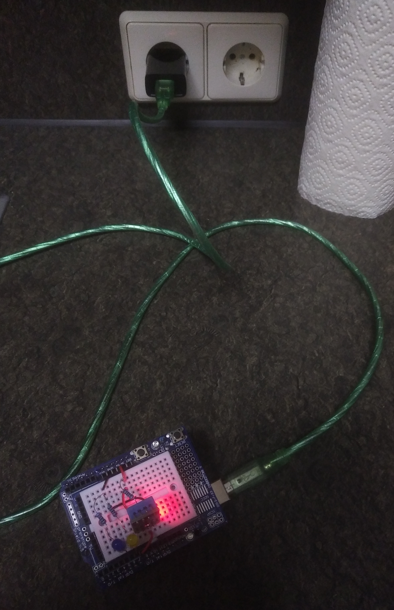

Die Daten kann man dann am einfachsten bearbeiten, indem man sie aus dem Serial Monitor kopiert und ganz unten auf der Seite
[convertcsv.com](https://www.convertcsv.com/csv-viewer-editor.htm)
einfügt.
Dort werden sie dann schön als Tabelle dargestellt und man kann sie kopieren und in Excel, Libreoffice, ... verwenden.

Möchte man sie ohne Internet direkt verwenden, kann man sie aus dem Serial Monitor kopieren, in eine Datei speichern und dann

- in _libreoffice_: Datei -- Öffnen -- diese Datei auswählen -- beim Importieren das Trennzeichen _Semikolon_ und die Sprache _Englisch USA_ auswählen.
- in _octave_: `data = dlmread('datei', ';')`
- in _gnuplot_: ` plot 'datei' u 1:3 w lp title Temperatur, '' u 1:5 w lp title "Luftfeuchte"`

Es zeigt sich beim Auswerten der Daten, dass es geschickt ist, wenn die erste Spalte statt des Index eine Zeit anzeigen würde.
Den Index bekommt man bei den meisten Programmen so wie so „geschenkt“.

Das Programm wurde deshalb so abgeändert, dass es in der ersten Spalte wirklich die Zeit seit Aufzeichnungsbeginn in s ausgibt.

Das Schöne: Dadurch, dass diese Daten direkt beim Auslesen berechnet werden, kann man „alte“ Daten aus dem EEPROM auslesen und bekommt trotzdem den „schönen neuen Zeit-Index“.

Die Daten von dem Dauerlauf finden sich
[hier](dauerlauf.dat)
und hier sind sie graphisch ausgewertet:

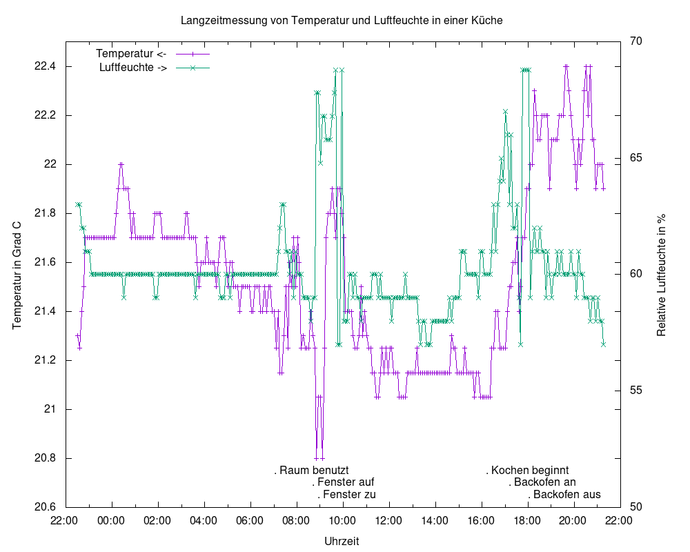

Man erkennt hier sehr schön:

- Sind Leute im Raum, steigt die Temperatur und meist auch die Luftfeuchte
- Wird das Fenster geöffnet, sinkt die Temperatur schnell ab, und geht wieder hoch, wenn es zu ist.
- Kochen/Backofenbenutzung erhöht die Luftfeuchte relativ stark

Was offen ist:
Warum steigt die Luftfeuchte ab ca 8:40 so stark an und bleibt so hoch?
Am Anfang der Zeit war ein Fenster kurz offen, den Rest der Zeit war nichts besonders.
Möglicherweise kam hier feuchte Luft von außen...
Das war auch die Zeit, in der die Fenster beschlagen waren.

## Doppelstunde 13: Protokoll abschließen

Hinweis: Für den Schlafmodus des Arduinos bleibt leider keine Zeit mehr.

Erstellung der Evaluation und des Ausblicks, allgemeine Formatierung usw.

# Evaluation

Siehe auch oben unter _Anforderungen_.

Der Erfüllungsgrad ist in Schulnoten angegeben.

| Anforderung | Erfüllt? | Kommentar |
| ----------- | -------- | --------- |
| Einfache Bedienbarkeit | 2 | Einstecken und es wird gemessen.  Die Uhrzeit für den Start muss man sich notieren, deshalb keine 1. |
| Klar ersichtlicher Status | 2 | Fehler/Speicher voll sind sofort erkennbar, ebenso ob das Gerät in Betrieb ist (Lampe am Sensor und am Arduino leuchtet, sonst nichts).  Noch besser wäre, wenn man den Status an einem Bildschirm ablesen könnte oder die LEDs nocht "beschriftet" sind, sodass man intuitiv versteht, in welchem Status das Gerät grade ist. |
| Speicherplatz | 1 | Es können ca 500 Einträge erfasst werden, bei einem Eintrag alle 5 min sind das 41 Stunden. |
| Präzision | 3 | Laut Datenblatt kann der DHT11 die Temperatur nicht so genau angeben, ebenso scheint es eine systematische Abweichung zu geben: Wenn mit einem Referenzsensor gemessen wird, dann wird damit eine andere Temperatur ermittelt als der DHT11 anzeigt.  Für Luftfeuchte ist die Genauigkeit in Ordnung. |
| Einsatzbereich | 1 | Laut Datenblatt der Sensoren und des Arduino erfüllt -- keine exakten Tests dazu ausgeführt. |
| Austauschformat | 1 | Das Format ist [CSV](https://de.wikipedia.org/wiki/CSV_(Dateiformat)) ohne Sonderzeichen, was ein sehr gutes (da bekanntes) Austauschformat darstellt. |

Insgesamt kann man mit dem Prototypen zufrieden sein, es wäre aber angebracht, nochmal Versuche mit mit einem besseren Sensor (bspw. DHT22) durchzuführen.

Die Analyse der Daten aus dem Dauerlauf hat schon gezeigt, dass man aus den Messwerten manches interessantes herauslesen kann.
Leider konnte genau die ursprüngliche Frage, warum die Fenster zu einer bestimmten Frage, nicht erschöpfend beantwortet werden:
Die Antwort „weil die Luft da feucht ist“, die sich aus den Daten ergibt, ist sicherlich korrekt.
Woher die Feuchte kommt, ist aber leider aus den Daten nicht ersichtlich.
Mit besseren Sensoren hätte man sie wahrscheinlich aber auch nicht beantworten können -- vielleicht durch eine längere Untersuchung der Situation...

## Ausblick

### Alternativen zu Arduino

Für ein kommerzielles Produkt müsste man keinen Arduino verwenden, sondern könnte einen "nackten" Atmega oder Attiny verwenden, dann mit etwas mehr (externem) EEPROM.

Der Analyst könnte statt USB-Anschluss auch einen FTDI-USB-Dongle verwenden, sodass der Microcontroller keinen eigenen USB bräuchte.

Die Stromversorgung könnte ein IC7805 erledigen.

### Verbesserungen am Produkt

Wenn man weiterhin den EEPROM verwenden will, dann sollte man versuchen, ihn etwas "besser zu behandeln", weil er
[nur für 100 000 Schreib-Zyklen spezifiziert](https://randomnerdtutorials.com/arduino-eeprom-explained-remember-last-led-state/)
ist.
Danach können die Daten nicht mehr garantiert dauerhaft gespeichert werden.
[Hier](https://forum.arduino.cc/index.php?topic=29761.0)
werden Ideen genannt, die Lebensdauer zu erhöhen.

### Mehr Speicher

Wenn man die Daten _engmaschiger_ speichern könnte, wäre das schon gut.
Mit Sketch
[`lesson45_dht11.ino`](lesson45_dht11.ino)
wurde eine Messung alle 2 s aufgenommen; die Daten sind in
[`lueften.dat`](lueften.dat)
und hier ein Diagramm:

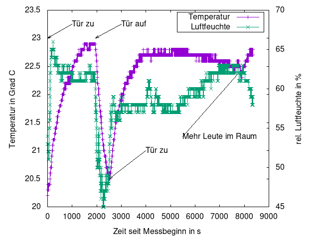

Man kann hier deutlich sehen, wie schnell die Luftfeuchte beim Lüften sinkt und wieder hochschnellt wenn man das Lüften beendet.
Diese rasche Änderung könnte man nicht sehen, wenn man nur alle 5 min misst.

Die zu speichernde Datenmenge würde damit um den Faktor `5 * 60/2 = ` 150 steigen; dafür reicht vermutlich kein EEPROM, und man müsste gleich entweder auf die teurere SD-Karte umsteigen oder das Produkt müsste ständig an einen PC angeschlossen sein (oder die Daten live per Mobilfunknetzwerk streamen, was aber noch Serverinfrastruktur braucht, die sich nur lohnt, wenn man das Produkt hinreichend oft verkauft).

### Marktanalyse

Das Gerät gibt es am Markt zu kaufen; bspw.
[hier als Datenlogger Luftfeuchte und Temperatur](https://www.datenlogger-store.de/klimalogger.html).

Günstige Geräte (ca 50 Euro) können ähnlich viel, wie das hier vorgestellte Gerät, haben komfortablere Bedienung und können mehr Daten speichern (bspw. mehrere Tausend Messwerte) oder direkt per Funk streamen.

Das Gerät zur Produktreife weiterzuentwickeln macht wahrscheinlich keinen Sinn, weil es davon schon zu viele am Markt gibt.
Als Lösung für Besitzer eines Arduinos könnte es aber interessant sein, weil die Kosten deutlich geringer sind als bei einem professionellen Gerät.
